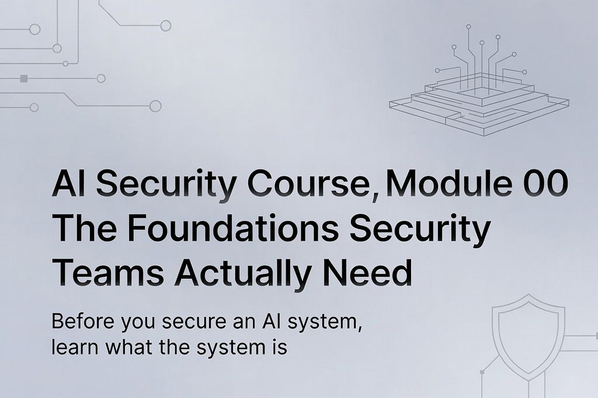
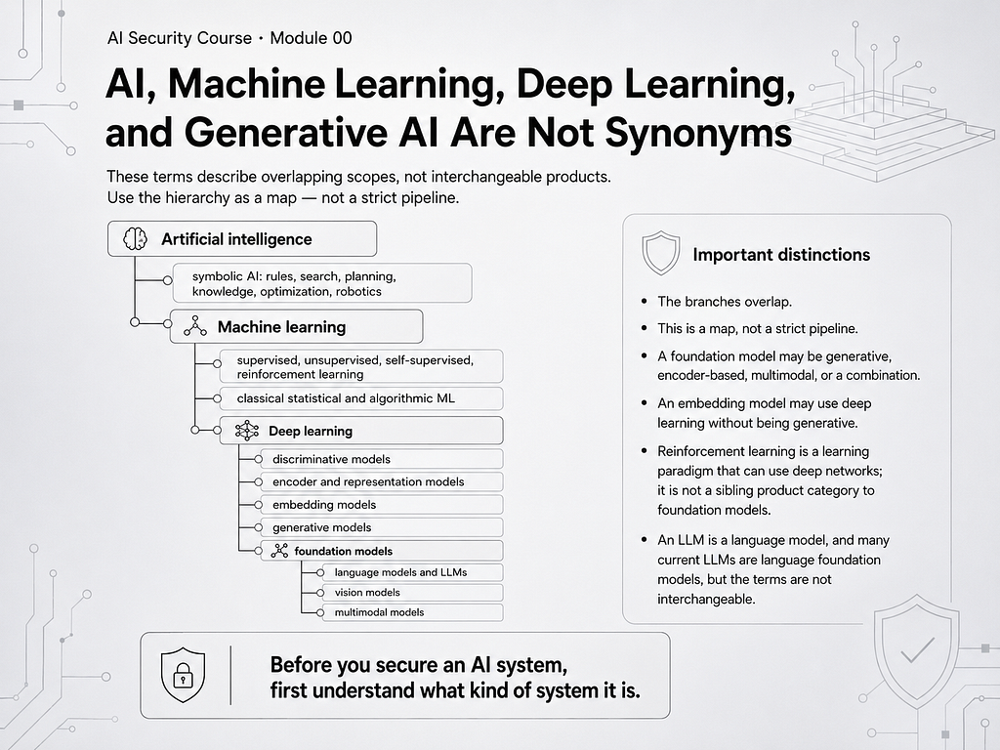
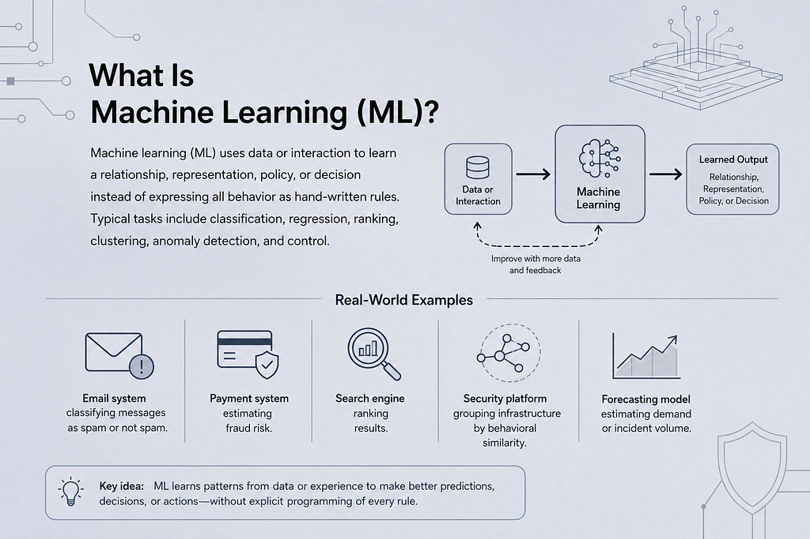
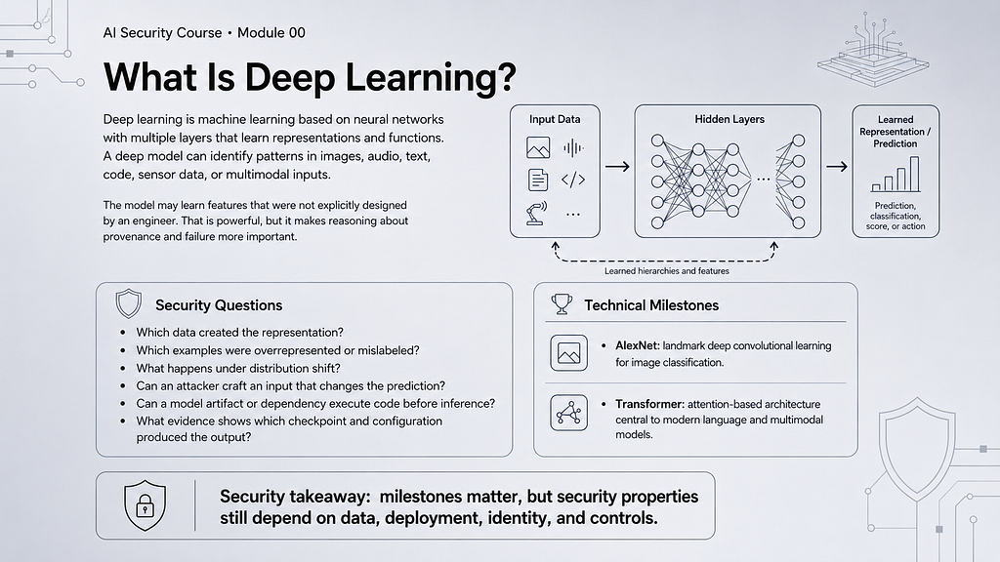
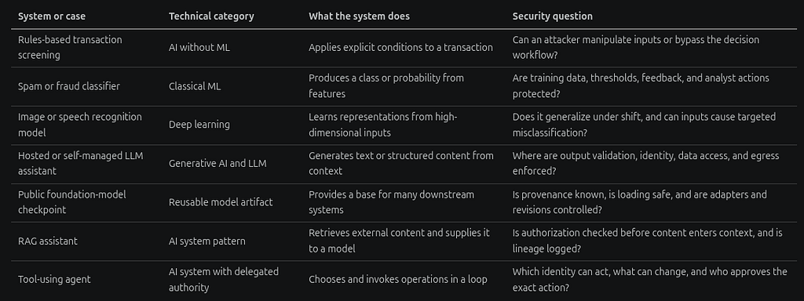
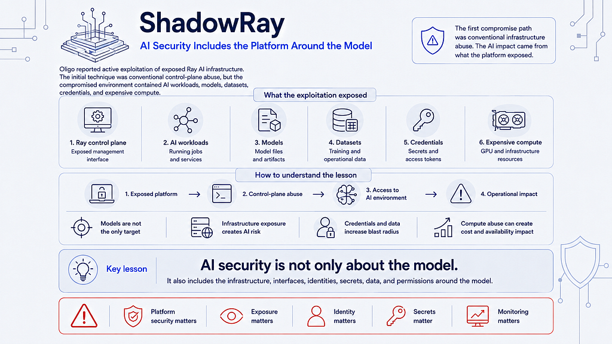
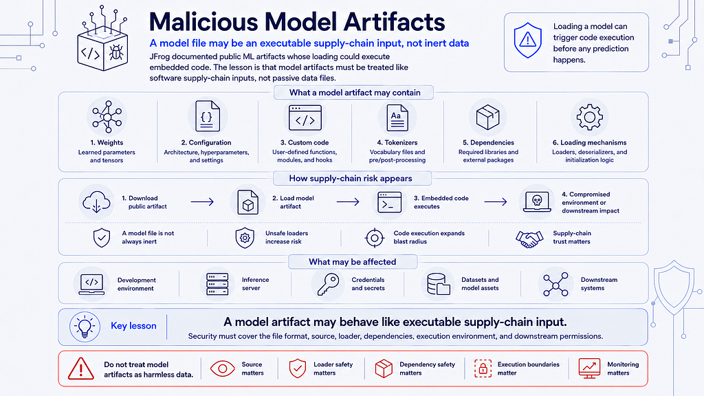
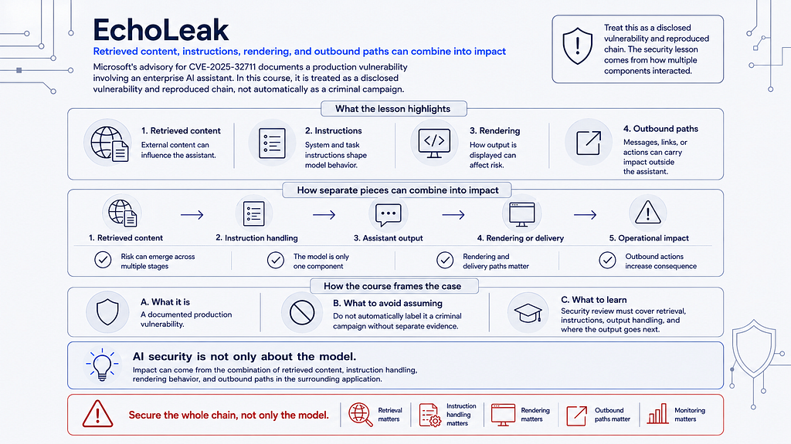
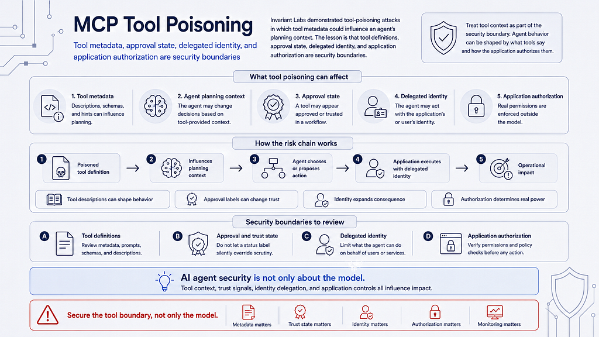

# AI Security Course, Module 00 — Part 1: Introduction, AI/ML Taxonomy, and Data Foundations

> **Under construction:** The course syllabus may change during creation. The scope, examples, references, labs, and assessment criteria may change before pilot delivery. The [original Medium publication](https://medium.com/@1200km/ai-security-course-module-00-part-1-introduction-ai-ml-taxonomy-and-data-foundations-2e26c0740a17) remains the source version for this chapter.

This is Part 1 of Module 00: **AI, Machine Learning, and LLM Foundations**. It introduces the complete AI-system boundary, explains the vocabulary used throughout the course, connects the terms to real security cases, and establishes the data foundations required for later chapters.

## Table of contents

- [Before you secure an AI system, learn what the system is](#before-you-secure-an-ai-system-learn-what-the-system-is)
- [The purpose of Module 00](#the-purpose-of-module-00)
- [Audience, prerequisites, and skip paths](#audience-prerequisites-and-skip-paths)
- [1. AI, machine learning, deep learning, and generative AI are not synonyms](#1-ai-machine-learning-deep-learning-and-generative-ai-are-not-synonyms)
- [Real-life examples: the label changes the security question](#real-life-examples-the-label-changes-the-security-question)
- [References for Chapter 1](#references-for-chapter-1)
- [2. How learning systems use data](#2-how-learning-systems-use-data)
- [Key takeaways](#key-takeaways)

## Before you secure an AI system, learn what the system is



*Figure 1 — An AI security system includes data, model artifacts, applications, identities, tools, infrastructure, operators, and downstream actions. [Open infographic](../assets/chapter-01/01-ai-security-system.jpeg).*

AI security conversations often begin with prompt injection, jailbreaks, or a new red-team tool. That is understandable, but it creates a dangerous starting point.

An AI system is not just a model.

It is a chain of data pipelines, model artifacts, prompts, retrieval systems, applications, identities, tools, memory, infrastructure, operators, and downstream actions. The model may generate text or choose an action, but it does not automatically provide authorization, tenant isolation, provenance, auditability, or safe execution.

That is why the first module of the AI Security Engineering course is not an attack lab. It is a technical foundation module for security practitioners who need to reason accurately about the complete system.

This article is Part 1 of the chapter-by-chapter version of Module 00. It covers the introduction, Chapter 1, and the data-foundation section that is now expanded in the standalone [Chapter 2 Markdown article](./chapter-02.md).

## The purpose of Module 00

Module 00 creates a shared technical language for the rest of the course. It is not intended to turn security engineers into research scientists, and it does not assume advanced mathematics. It teaches the mechanisms that affect security decisions:

- how learning systems use data;
- how models are trained, adapted, evaluated, and served;
- how LLMs turn tokens into generated output;
- how RAG moves external data into model context;
- how agents connect model output to tools and authority;
- how deployment and observability determine the blast radius;
- how terminology affects threat modeling and incident reporting.

The objective is practical precision. A learner should be able to look at an AI architecture and answer:

1. What are the assets?
2. Which component has authority?
3. Which data crosses a trust boundary?
4. Which artifacts and configurations can change behavior?
5. What evidence would reconstruct a security-relevant action?

## Audience, prerequisites, and skip paths

Module 00 is for security practitioners, AI platform engineers, MLOps engineers, threat-intelligence analysts, detection engineers, and technical risk owners who need a common operating vocabulary. Learners should be comfortable with basic security concepts such as identity, access control, logging, network boundaries, software dependencies, and incident evidence.

No advanced calculus, GPU programming, or model pretraining experience is required. Learners who already understand neural-network training may skim the optimization explanation in later parts, but should still complete the artifact, RAG, agent-authority, and observability traces. Learners who already operate LLM applications may skim introductory definitions, but should not skip the security boundaries around retrieval, tool execution, caching, identity, and evidence.

The sequence is intentionally flexible. Instructors can deepen a topic, assign the glossary as reference, or use the skip paths without changing the learning contract. Every learner should still be able to explain the complete request path and produce the required artifacts.

## 1. AI, machine learning, deep learning, and generative AI are not synonyms

The first source of confusion is vocabulary. These terms describe overlapping scopes, not interchangeable products. The hierarchy below is useful as a map, but it is not a strict pipeline: some AI systems use no machine learning, some foundation models are not language models, and some generative systems are specialized rather than broadly reusable.

```text
Artificial intelligence
├── symbolic AI: rules, search, planning, knowledge, optimization, robotics
└── Machine learning
    ├── supervised, unsupervised, self-supervised, and reinforcement learning
    ├── classical statistical and algorithmic ML
    └── Deep learning
        ├── discriminative models
        ├── encoder and representation models
        ├── embedding models
        ├── generative models
        └── foundation models
            ├── language models and LLMs
            ├── vision models
            └── multimodal models
```



*Figure 2 — AI, machine learning, deep learning, generative AI, foundation models, and LLMs are related but distinct scopes. [Open infographic](../assets/chapter-01/02-ai-ml-taxonomy.png).*

The branches overlap. A foundation model may be generative, encoder-based, multimodal, or a combination. An embedding model may be a deep-learning model without being generative. Reinforcement learning is a learning paradigm that can use deep networks; it is not a sibling product category to “foundation model.” An LLM is a language model, and many current LLMs are language foundation models, but the terms are not interchangeable.

### Artificial intelligence: the broadest category

**Artificial intelligence (AI)** is the broad field of machine-based systems that produce predictions, recommendations, decisions, or content for human-defined objectives. AI includes symbolic rules, search, planning, optimization, robotics, expert systems, statistical models, and neural networks.

Consider a rules-based transaction screening system:

```text
if amount > approved_limit
and destination_country is restricted
and account_age < policy_threshold:
    require manual review
```

This is an AI-related decision system even though it does not learn parameters from data. Its security risks are still real: an attacker may manipulate input fields, bypass the policy path, abuse the review workflow, or compromise the service account. Calling it “not AI” would not make those risks disappear.

At the other end of the spectrum, [DeepMind’s AlphaGo](https://deepmind.google/research/alphago/) combined deep neural networks, search, and reinforcement learning to select moves. It is a useful reminder that an AI system may contain several techniques at once. The model is only one part of the decision loop; the search procedure, state, interfaces, and execution environment also matter.

**Symbolic rules** are explicit, human-authored logic: conditions, facts, policies, and actions written in a form a program can evaluate. A firewall rule, an allowlist, or “require review when a payment exceeds its limit” is symbolic behavior. It is usually easier to inspect and reproduce than learned behavior, but it can be brittle, incomplete, and vulnerable to input manipulation or rule-order mistakes. In a security investigation, preserve the rule version, evaluation order, input fields, and decision path; there are no learned weights to inspect, but the policy implementation is still a security-critical artifact.

### Machine learning: behavior learned from data or experience

<https://www.youtube.com/watch?v=AhCcMOlPxJY>

*Video reference — machine learning: from AI concepts to learned behavior.*

**Machine learning (ML)** uses data or interaction to learn a relationship, representation, policy, or decision instead of expressing all behavior as hand-written rules. Typical tasks include classification, regression, ranking, clustering, anomaly detection, and control.



*Figure 3 — Machine-learning behavior is secured at the data, feature, model, and decision workflow boundaries. [Open infographic](../assets/chapter-01/03-machine-learning-security-boundary.png).*

Real-world examples include:

- an email system classifying messages as spam or not spam;
- a payment system estimating fraud risk;
- a search engine ranking results;
- a security platform grouping infrastructure by behavioral similarity;
- a forecasting model estimating demand or incident volume.

[Google’s classification guide](https://developers.google.com/machine-learning/crash-course/classification/) is a useful reference for labels, predictions, thresholds, false positives, and false negatives.

The security boundary is the data and decision workflow around the model. A phishing classifier can be accurate and still be unsafe if an attacker poisons its training data, manipulates features, extracts sensitive examples, or causes an operator to treat a probability score as an authorization decision. The score is evidence for a policy; it is not the policy itself.

### Deep learning: multilayer representation learning

<https://www.youtube.com/watch?v=CMdWxIo-Qv8&t=74s>

*Video reference — deep learning: multilayer representations and learned features.*

**Deep learning** is ML based on neural networks with multiple layers that learn representations and functions. A deep model can identify patterns in images, audio, text, code, sensor data, or multimodal inputs.



*Figure 4 — Deep learning uses multilayer neural networks to learn representations and functions. [Open infographic](../assets/chapter-01/04-deep-learning.png).*

The model may learn features that were not explicitly designed by an engineer. That is powerful, but it makes reasoning about provenance and failure more important. Security questions include:

- Which data created the representation?
- Which examples were overrepresented or mislabeled?
- What happens under distribution shift?
- Can an attacker craft an input that changes the prediction?
- Can a model artifact or dependency execute code before inference?
- What evidence shows which checkpoint and configuration produced the output?

The [AlexNet paper](https://proceedings.neurips.cc/paper/2012/hash/c399862d3b9d6b76c8436e924a68c45b-Abstract.html) is a landmark example of deep convolutional learning for image classification. The Transformer architecture later introduced attention-based processing that became central to modern language and multimodal models. These are technical milestones; the security properties still depend on data, deployment, identity, and controls.

### Generative AI: producing new content

**Generative AI** produces new text, code, images, audio, video, or structured content. Generation may use autoregressive Transformers, diffusion models, generative adversarial networks, flow-based models, or other architectures.

<https://www.youtube.com/watch?v=ZK28lp4qsqI>

*Video reference — generative AI: how models produce new content.*

Examples include:

- an LLM drafting a report or generating code;
- an image model creating a synthetic image from a text prompt;
- a speech model generating audio;
- a coding assistant proposing a patch;
- an agent generating a structured API call.

The output is not automatically an answer, a fact, or an authorized action. It is a model-produced artifact that must be validated in the context where it will be used. An output rendered as HTML has a different risk than an output shown as plain text. An output passed to a ticketing API has a different risk than an output read by an analyst.

[OpenAI’s GPT-4 research report](https://openai.com/index/gpt-4-research/) illustrates this distinction: evaluation results describe measured behavior under defined conditions; they do not replace application authorization, identity controls, or production monitoring.

For image generation, the [DDPM paper](https://arxiv.org/abs/2006.11239) is a primary reference for diffusion-model foundations. The security lesson is not that every generative model has the same vulnerability. It is that each generated output becomes part of a downstream data and decision path.

### Foundation models: broadly reusable starting points

<https://www.youtube.com/watch?v=OgzkydUdF9I>

*Video reference — foundation models: reusable model capabilities and dependency concentration.*

A **foundation model** is trained on broad data and designed to support multiple downstream tasks or applications through prompting, adaptation, fine-tuning, retrieval, or additional system components. See Stanford’s [What are Foundation Models?](https://hai.stanford.edu/ai-definitions/what-are-foundation-models) and [Bommasani et al., On the Opportunities and Risks of Foundation Models](https://arxiv.org/abs/2108.07258).

Foundation models create concentration of dependency and supply-chain risk. One base model may be:

- fine-tuned by many teams;
- wrapped by many applications;
- downloaded from a public registry;
- combined with different adapters and tokenizers;
- connected to different retrieval systems and tools;
- deployed under identities with very different authority.

The same checkpoint can therefore be low-risk in an isolated research notebook and high-risk inside an agent with access to private documents, cloud APIs, or production systems. “The model is safe” is incomplete unless the model version, wrapper, data, identity, tools, and deployment are specified.

### Large language models: token prediction at scale

An **LLM** is a large language model, usually based on a Transformer architecture, that predicts a probability distribution over tokens and generates sequences by repeatedly selecting the next token. It may support summarization, translation, classification, code generation, question answering, reasoning-like workflows, or tool selection.

<https://www.youtube.com/watch?v=Zas3ufXo9wg>

*Video reference — large language models: tokens, language generation, and application boundaries.*

The original [Attention Is All You Need](https://arxiv.org/abs/1706.03762) paper introduced the Transformer architecture that underlies many current language and multimodal systems. The [GPT-4 research report](https://openai.com/index/gpt-4-research/) is a historical example of how a provider describes capabilities, evaluation, limitations, and system-level safety work.

An LLM does not inherently provide:

- current or complete knowledge;
- truth verification;
- tenant authorization;
- secret management;
- stable identity;
- transactional integrity;
- safe tool execution;
- deterministic policy enforcement.

Those properties come from the application and operating environment.

## Real-life examples: the label changes the security question



*Figure 5 — The system label changes the security question and the evidence a defender should collect. [Open infographic](../assets/chapter-01/05-real-life-examples.png).*

| System or case | Technical category | What the system does | Security question |
|---|---|---|---|
| Rules-based transaction screening | AI without ML | Applies explicit conditions to a transaction | Can an attacker manipulate inputs or bypass the decision workflow? |
| Spam or fraud classifier | Classical ML | Produces a class or probability from features | Are training data, thresholds, feedback, and analyst actions protected? |
| Image or speech recognition model | Deep learning | Learns representations from high-dimensional inputs | Does it generalize under shift, and can inputs cause targeted misclassification? |
| Hosted or self-managed LLM assistant | Generative AI and LLM | Generates text or structured content from context | Where are output validation, identity, data access, and egress enforced? |
| Public foundation-model checkpoint | Reusable model artifact | Provides a base for many downstream systems | Is provenance known, is loading safe, and are adapters and revisions controlled? |
| RAG assistant | AI system pattern | Retrieves external content and supplies it to a model | Is authorization checked before content enters context, and is lineage logged? |
| Tool-using agent | AI system with delegated authority | Chooses and invokes operations in a loop | Which identity can act, what can change, and who approves the exact action? |

### Security cases that make the distinction concrete

The course uses real reports to connect terminology to operational risk. Evidence labels matter: a confirmed incident, disclosed vulnerability, malicious artifact, provider-observed activity, demonstrated research result, forecast, and constructed scenario are not interchangeable.

#### ShadowRay



*Figure 6 — ShadowRay. [Open infographic](../assets/chapter-01/06-shadowray.png).*

[Oligo reported active exploitation of exposed Ray AI infrastructure](https://www.oligo.security/blog/shadowray-attack-ai-workloads-actively-exploited-in-the-wild). The initial technique was conventional control-plane abuse, but the compromised environment contained AI workloads, models, datasets, credentials, and expensive compute. The lesson is that AI security includes the platform around the model.

#### Malicious model artifacts



*Figure 7 — Malicious model artifacts. [Open infographic](../assets/chapter-01/07-malicious-model-artifacts.png).*

[JFrog documented public ML artifacts whose loading could execute embedded code](https://jfrog.com/blog/data-scientists-targeted-by-malicious-hugging-face-ml-models-with-silent-backdoor/). The lesson is that a model file may be an executable supply-chain input, not inert data.

#### EchoLeak



*Figure 8 — EchoLeak. [Open infographic](../assets/chapter-01/08-echoleak.png).*

Microsoft’s advisory for [CVE-2025-32711](https://msrc.microsoft.com/update-guide/vulnerability/CVE-2025-32711) documents a production vulnerability involving an enterprise AI assistant. The course treats it as a disclosed vulnerability and reproduced chain, not automatically as a criminal campaign. The lesson is that retrieved content, instructions, rendering, and outbound paths can combine into impact.

#### MCP tool poisoning



*Figure 9 — MCP tool poisoning. [Open infographic](../assets/chapter-01/09-mcp-tool-poisoning.png).*

[Invariant Labs demonstrated tool-poisoning attacks](https://invariantlabs.ai/blog/mcp-security-notification-tool-poisoning-attacks) in which tool metadata could influence an agent’s planning context. The lesson is that tool definitions, approval state, delegated identity, and application authorization are security boundaries.

### A practical test for terminology

When a report says “AI attack,” ask six questions before accepting the phrase:

1. Is the target a model, a data pipeline, an application, an agent, an identity, or infrastructure?
2. Is AI the target, the delivery mechanism, the enabling tool, or simply part of the environment?
3. Did the report establish feasibility, exposure, provider-observed activity, exploitation, or harm?
4. Which model, artifact, prompt, retrieval set, tool definition, identity, and runtime were involved?
5. What state or authority changed after the model produced its output?
6. Which deterministic control could have prevented, constrained, detected, or preserved the action?

If the report cannot answer these questions, it may still be useful as a lead, but it is not yet a complete threat model.

## References for Chapter 1

- [NIST AI 100-3: The Language of Trustworthy AI](https://doi.org/10.6028/NIST.AI.100-3)
- [Google Machine Learning Crash Course: Classification](https://developers.google.com/machine-learning/crash-course/classification/)
- [DeepMind: AlphaGo](https://deepmind.google/research/alphago/)
- [Krizhevsky, Sutskever, and Hinton: ImageNet Classification with Deep Convolutional Neural Networks](https://proceedings.neurips.cc/paper/2012/hash/c399862d3b9d6b76c8436e924a68c45b-Abstract.html)
- [Bommasani et al.: On the Opportunities and Risks of Foundation Models](https://arxiv.org/abs/2108.07258)
- [Oligo: ShadowRay](https://www.oligo.security/blog/shadowray-attack-ai-workloads-actively-exploited-in-the-wild)
- [JFrog: Malicious Hugging Face ML Models](https://jfrog.com/blog/data-scientists-targeted-by-malicious-hugging-face-ml-models-with-silent-backdoor/)
- [Microsoft MSRC: CVE-2025-32711](https://msrc.microsoft.com/update-guide/vulnerability/CVE-2025-32711)
- [Invariant Labs: MCP Tool Poisoning Attacks](https://invariantlabs.ai/blog/mcp-security-notification-tool-poisoning-attacks)

## 2. How learning systems use data

Security engineers need to understand where data enters the lifecycle and what happens to it.

```text
collect and document data
  → clean, transform, label, and split
  → select architecture and objective
  → initialize parameters
  → train on batches
  → validate and tune hyperparameters
  → evaluate on held-out conditions
  → release a specific artifact
  → monitor inputs, behavior, outcomes, cost, and drift
  → retrain, roll back, replace, or retire
```

The key terms are different security objects. They have different owners, provenance, integrity controls, retention rules, and failure modes. Treating them all as “the model” makes an incident difficult to reproduce and can cause the wrong control to be applied.

The complete, expanded treatment of this section is maintained in the standalone [Module 00 Chapter 2 article](./chapter-02.md), including data, features, labels, parameters, hyperparameters, training, validation, testing, inference, a phishing-classifier case study, and the evidence-preservation checklist.

## Key takeaways

- AI is a broad category that includes symbolic rules, search, optimization, classical ML, deep learning, and generative systems.
- Symbolic rules are explicit logic; learned models derive behavior from data or interaction. Both are security-critical and require versioned evidence.
- “LLM” describes a language model, not an authorization system, data-governance system, or safe execution environment.
- The model is only one component of an AI system. Data, applications, identities, tools, infrastructure, and downstream actions determine the security boundary.
- A model score or generated output is evidence for a policy decision, not the policy itself.
- During incident response, identify the exact artifact, configuration, input, context, identity, and downstream action before claiming that “the AI” caused an outcome.

## What comes next

[Chapter 2 — How Learning Systems Use Data](./chapter-02.md) continues with data, features, labels, model artifacts, configuration, evaluation, inference, and CTI evidence. Later parts will trace neural networks, tokens and Transformer context assembly, the LLM lifecycle, RAG authorization, agent and tool authority, and serving observability.

---

**AI Security Engineering Course — under construction.** The syllabus, examples, references, labs, and assessment criteria may change during creation.

[1200km.com](https://1200km.com) · [Main course article on Medium](https://medium.com/@1200km/im-building-an-ai-security-engineering-course-55e29e6c035e)
