# AI Security Course, Module 00 — Chapter 2: How Learning Systems Use Data

> **Published companion / under construction:** This course chapter is published as a companion to the [Medium article](https://medium.com/@1200km/ai-security-course-module-00-chapter-2-69381c74a59c?postPublishedType=repub), but remains part of a course under construction. The syllabus, examples, references, exercises, and terminology may change during creation and pilot delivery. The Medium publication remains the source version for this chapter.

Data, features, labels, parameters, hyperparameters, training, validation, testing, and inference are different security objects. This chapter turns that vocabulary into an evidence-preserving workflow for AI security engineering.

## Table of contents

1. [Data is a lifecycle object](#1-data-is-a-lifecycle-object)
2. [Features are representations and attack surfaces](#2-features-are-representations-and-attack-surfaces)
3. [Labels are judgments, not automatic truth](#3-labels-are-judgments-not-automatic-truth)
4. [Parameters and model artifacts](#4-parameters-and-model-artifacts)
5. [Hyperparameters and configuration](#5-hyperparameters-and-configuration)
6. [Training as a security-sensitive build](#6-training-as-a-security-sensitive-build)
7. [Validation, testing, and generalization](#7-validation-testing-and-generalization)
8. [Inference is where authority meets input](#8-inference-is-where-authority-meets-input)
9. [The same bytes can have different roles](#9-the-same-bytes-can-have-different-roles)
10. [CTI case study: a phishing classifier](#10-cti-case-study-a-phishing-classifier)
11. [From terminology to controls and evidence](#11-from-terminology-to-controls-and-evidence)
12. [Analyst exercise and completion criteria](#12-analyst-exercise-and-completion-criteria)
13. [References](#references)

## Security starts before the model sees a request


*Figure 1 — The Chapter 2 lifecycle: data and feedback become representations, learned artifacts, configuration, inference, policy, and evidence.*

A model does not appear at the end of a clean, neutral pipeline. Someone selected the data sources, wrote collection code, filtered records, assigned labels, chose a split, trained an artifact, tuned configuration, approved a release, and connected the result to an application. Every one of those decisions can change behavior.

That is why “the model classified it” is not a sufficient incident explanation. A result can change because a data source changed, a feature parser was upgraded, a label policy drifted, a checkpoint was replaced, an adapter was loaded, a threshold moved, a prompt template changed, or a retrieval index supplied different context.

```text
source data and feedback
  → collection and provenance
  → cleaning, parsing, and representation
  → labels and dataset splits
  → objective, training, and learned parameters
  → validation, testing, and release decision
  → inference input, context, and configuration
  → prediction, generation, policy, and downstream action
  → telemetry, feedback, drift, and the next data version
```

> **Course rule:** Treat every data copy, model artifact, configuration value, and decision as an identifiable security object. If it cannot be named and versioned, it cannot be reliably investigated.

## 1. Data is a lifecycle object

**Data** is any input used to learn, evaluate, retrieve, or generate. In a phishing classifier, the message body, headers, URLs, sender reputation, analyst disposition, and later feedback are all data. In a retrieval-augmented generation (RAG) application, source documents, parsed text, chunks, metadata, access-control lists, embeddings, user questions, retrieved passages, and conversation history are separate data objects.

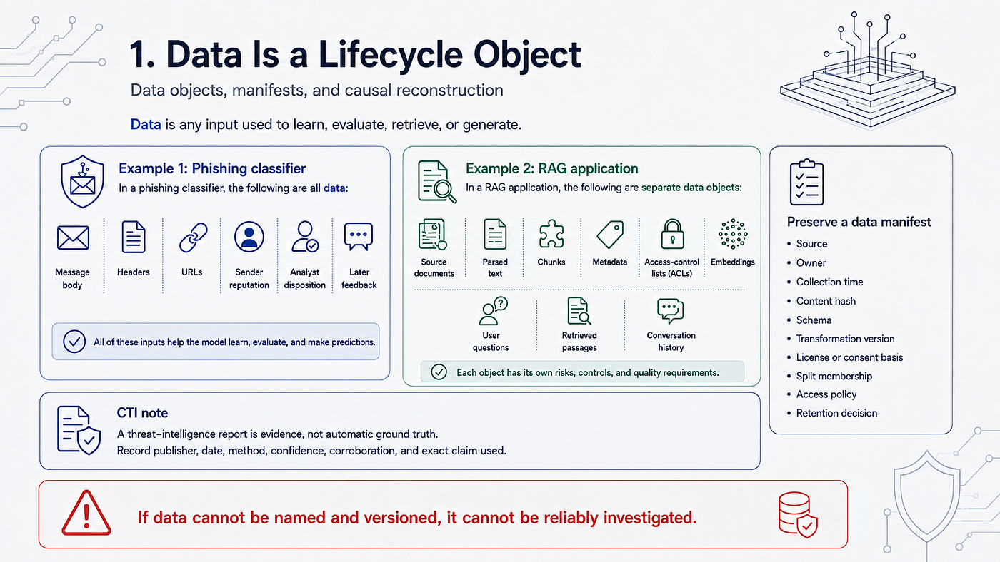

*Figure 2 — Data appears in multiple roles across learning, retrieval, generation, and feedback.*

“Internal” is not a security classification by itself. A public threat report can become sensitive when it is combined with an internal incident timeline. A user prompt can contain credentials even when the model provider is trusted. A log can create a second, longer-lived copy of a prompt that the application was supposed to delete.

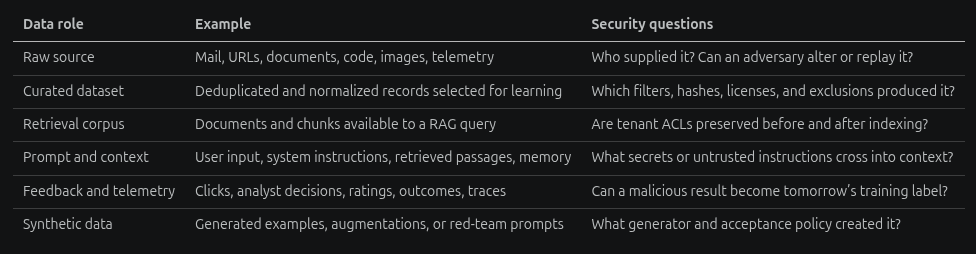

*Figure 3 — Data classification must preserve provenance, access, integrity, and retention decisions as data changes role.*

| Data role | Example | Security questions |
|---|---|---|
| Raw source | Mail, URLs, documents, code, images, telemetry | Who supplied it? Can an adversary alter or replay it? |
| Curated dataset | Deduplicated and normalized records selected for learning | Which filters, hashes, licenses, and exclusions produced it? |
| Retrieval corpus | Documents and chunks available to a RAG query | Are tenant ACLs preserved before and after indexing? |
| Prompt and context | User input, system instructions, retrieved passages, memory | What secrets or untrusted instructions cross into context? |
| Feedback and telemetry | Clicks, analyst decisions, ratings, outcomes, traces | Can a malicious result become tomorrow’s training label? |
| Synthetic data | Generated examples, augmentations, or red-team prompts | What generator and acceptance policy created it? |

Preserve a data manifest with the source, owner, collection time, content hash, schema, transformation version, license or consent basis, split membership, access policy, and retention decision. A manifest is not bureaucracy; it is the first line of causal reconstruction.

### CTI connection

A threat-intelligence report is evidence, not a magic “ground truth” label. Record the publisher, publication date, collection method, confidence, corroborating sources, and the exact claim being used. Do not silently turn an unconfirmed report into a supervised target.

## 2. Features are representations and attack surfaces

**Features** are the representations consumed by a task or model. A phishing detector might use URL length, sender-domain age, authentication results, character n-grams, and attachment metadata. An image model consumes normalized pixel tensors. An LLM consumes token IDs and attention masks. A RAG system may use dense vectors, sparse terms, metadata filters, and a reranker score.

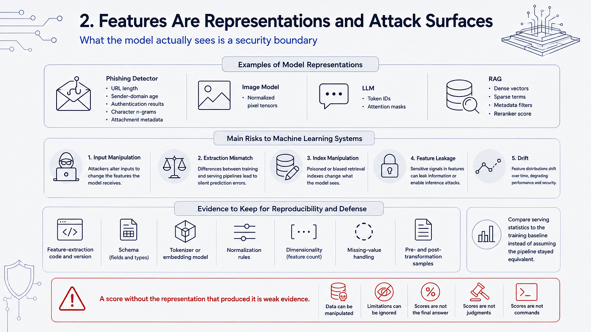

*Figure 4 — Features turn business objects into model inputs, creating representation and extraction boundaries.*

Features can be designed by an engineer, extracted by a parser, or learned by earlier neural-network layers. The representation is therefore a security boundary: an attacker can keep the apparent business object unchanged while manipulating the bytes or structure that the model actually sees.

- **Input manipulation:** alter URL encoding, Unicode, image pixels, document structure, or headers to change representation.
- **Extraction mismatch:** use different parsing, normalization, tokenization, or missing-value behavior in training and serving.
- **Index manipulation:** insert, delete, or duplicate vector records so retrieval returns an attacker-controlled passage.
- **Feature leakage:** allow a feature to contain information that would only be known after the decision.
- **Drift:** let the real-world distribution move beyond the conditions represented during evaluation.

Google’s documentation on [training-serving skew](https://cloud.google.com/blog/topics/developers-practitioners/monitor-models-training-serving-skew-vertex-ai) and its [`ML.VALIDATE_DATA_SKEW` function](https://docs.cloud.google.com/bigquery/docs/reference/standard-sql/bigqueryml-syntax-validate-data-skew) show the operational version of this problem: compare serving statistics with the training baseline instead of assuming the feature pipeline stayed equivalent.

For security evidence, retain the feature-extraction code and version, schema, tokenizer or embedding model, normalization rules, dimensionality, missing-value handling, and a sample of the pre- and post-transformation input. A score without the representation that produced it is weak evidence.

## 3. Labels are judgments, not automatic truth

**Labels** identify the target a supervised system is expected to predict: `phishing` or `benign`, malware family, severity, entity span, or preferred response. A label is a judgment made under a policy. It is not automatically ground truth.

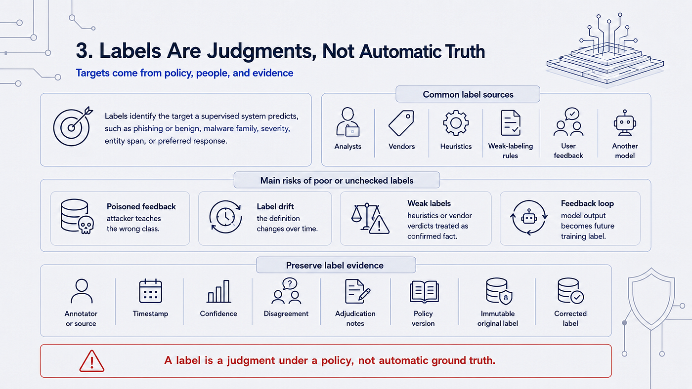

*Figure 5 — A label is a policy-bound judgment with a source, confidence, and error profile.*

Labels may come from analysts, vendors, heuristics, weak-labeling rules, user feedback, or another model. Each source has a different error profile. “Malicious” might mean a confirmed payload, a suspicious campaign, a policy violation, or a message later linked to an incident. Those are different targets and should not be merged without an explicit policy.

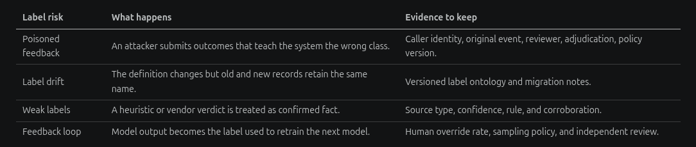

*Figure 6 — Preserve the original label, later correction, reviewer, confidence, and policy version instead of overwriting history.*

| Label risk | What happens | Evidence to keep |
|---|---|---|
| Poisoned feedback | An attacker submits outcomes that teach the system the wrong class. | Caller identity, original event, reviewer, adjudication, policy version. |
| Label drift | The definition changes but old and new records retain the same name. | Versioned label ontology and migration notes. |
| Weak labels | A heuristic or vendor verdict is treated as confirmed fact. | Source type, confidence, rule, and corroboration. |
| Feedback loop | Model output becomes the label used to retrain the next model. | Human override rate, sampling policy, and independent review. |

During triage, preserve annotator or source, timestamp, confidence, disagreement, adjudication notes, and the policy version. An immutable original label plus a later corrected label is more useful than silently overwriting history.

## 4. Parameters and model artifacts

**Parameters** are values learned during optimization: weights, biases, embedding tables, normalization statistics, and adapter or low-rank update weights. They encode behavior, but they remain artifacts that must be identified and protected like compiled software.

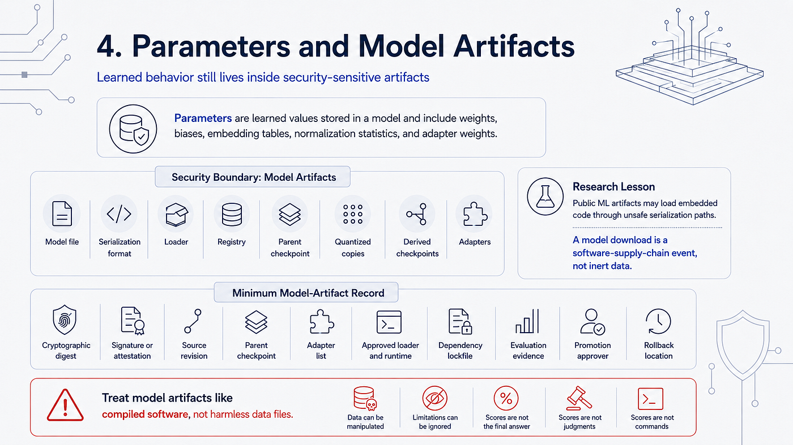

*Figure 7 — Learned parameters travel through model files, checkpoints, adapters, loaders, and registries that require provenance controls.*

The security boundary includes the model file, serialization format, loader, registry, parent checkpoint, derived checkpoints, quantized copies, and adapters. A surprising output can come from an unapproved adapter or a different quantized artifact even when the base-model name is unchanged.

JFrog’s research, [Data Scientists Targeted by Malicious Hugging Face ML Models](https://jfrog.com/blog/data-scientists-targeted-by-malicious-hugging-face-ml-models-with-silent-backdoor/), documented a public model whose loading could execute embedded code through an unsafe serialization path. This was security research, not proof that every public model is malicious. Its evidence-based lesson is precise: a model download is a software-supply-chain event, not merely the transfer of inert data.

MITRE ATLAS also records [Poison Training Data (AML.T0020)](https://atlas.mitre.org/techniques/AML.T0020) and related model-supply-chain techniques. Use the technique as a vocabulary and mapping aid; use the underlying report, artifact, or telemetry to establish what actually happened.

### Minimum model-artifact record

Keep the cryptographic digest, signature or attestation, source revision, parent checkpoint, adapter list, serialization format, approved loader and runtime, dependency lockfile, evaluation evidence, promotion approver, and rollback location.

## 5. Hyperparameters and configuration

**Hyperparameters** are selected configuration values rather than values learned from training examples. They include learning rate, batch size, optimizer, number of epochs, architecture depth, regularization, chunk size, retrieval `top-k`, and early-stopping policy.

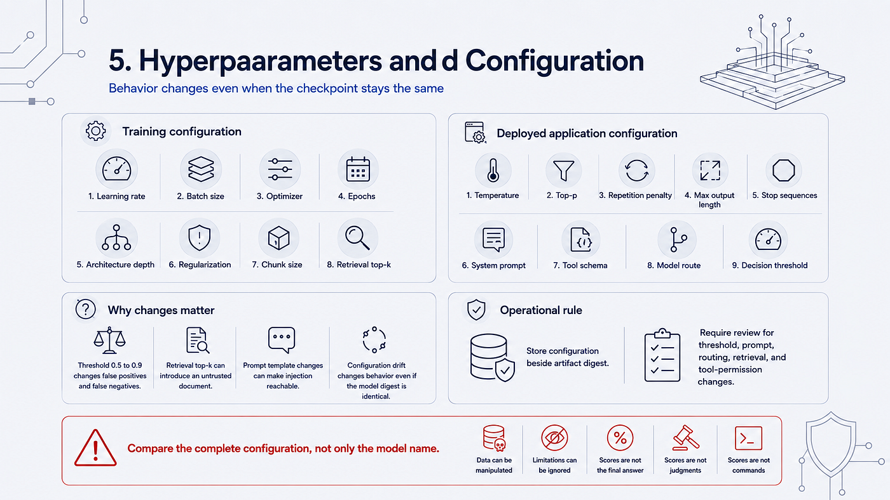

*Figure 8 — Configuration such as thresholds, prompts, routing, retrieval, and decoding can change the security outcome.*

In a deployed generative application, temperature, `top-p`, repetition penalty, maximum output length, stop sequences, system prompt, tool schema, and model route also change behavior. A decision threshold is usually policy configuration rather than a model hyperparameter, but it belongs in the same release record because it changes the security outcome.

For example, changing a phishing threshold from 0.5 to 0.9 can reduce false positives while increasing false negatives, without changing one learned weight. Changing retrieval `top-k` can introduce an untrusted document into context. Changing a prompt template can make an injection reachable. Configuration drift is a behavior change even when the checkpoint digest is identical.

Store configuration beside the artifact digest, not in an undocumented environment variable. Require review for threshold, prompt, routing, retrieval, and tool-permission changes. During response, compare the complete configuration—not only the model name—with the last known-good release.

## 6. Training as a security-sensitive build

**Training** updates parameters using data, an objective, and an optimization procedure. Pre-training may use next-token prediction; supervised fine-tuning may use instruction examples; preference optimization may update behavior using ranked outcomes. The runner may have access to incident reports, source code, credentials, package registries, checkpoints, and expensive compute.

```text
data manifest + code revision + dependency lockfile
  → parser, filter, and label policy
  → split and leakage checks
  → objective, seed, and initialization
  → training jobs and checkpoints
  → validation decisions and selected artifact
  → security/capability evaluation
  → signed registry entry and release approval
```

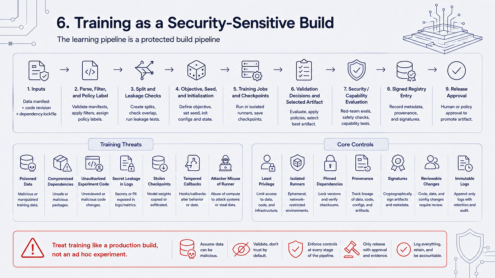

*Figure 9 — Training is a build pipeline with provenance, isolated runners, checkpoints, evaluation, and release approval.*

Training threats include poisoned data, compromised dependencies, unauthorized experiment code, secret leakage in logs, stolen checkpoints, tampered callbacks, and an attacker using the training runner for another workload. The controls look familiar to a CTI or software-supply-chain analyst: least privilege, isolated runners, pinned dependencies, provenance, signatures, reviewable changes, and immutable logs.

### Learning paradigms and their security questions

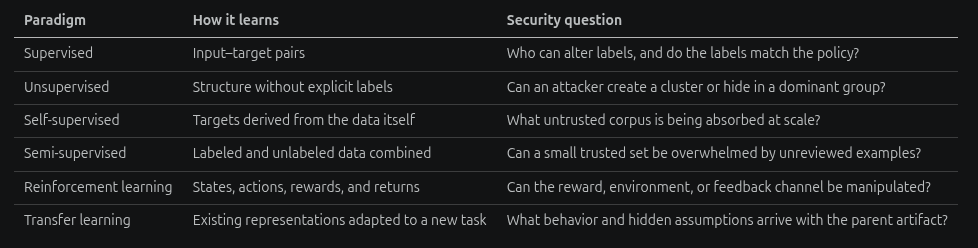

*Figure 10 — Each learning paradigm exposes a different source of influence: labels, corpora, feedback, environments, or parent artifacts.*

| Paradigm | How it learns | Security question |
|---|---|---|
| Supervised | Input–target pairs | Who can alter labels, and do the labels match the policy? |
| Unsupervised | Structure without explicit labels | Can an attacker create a cluster or hide in a dominant group? |
| Self-supervised | Targets derived from the data itself | What untrusted corpus is being absorbed at scale? |
| Semi-supervised | Labeled and unlabeled data combined | Can a small trusted set be overwhelmed by unreviewed examples? |
| Reinforcement learning | States, actions, rewards, and returns | Can the reward, environment, or feedback channel be manipulated? |
| Transfer learning | Existing representations adapted to a new task | What behavior and hidden assumptions arrive with the parent artifact? |

## 7. Validation, testing, and generalization

**Validation** supports development choices: threshold, prompt template, architecture, early-stopping checkpoint, retriever, or hyperparameters. **Testing** estimates behavior on held-out conditions that were not used to fit parameters or make routine decisions. The distinction is about how evidence was used, not the filename of a dataset.

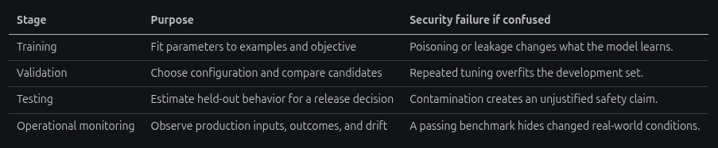

*Figure 11 — Validation supports development choices and must be separated from the held-out evidence used for testing.*

| Stage | Purpose | Security failure if confused |
|---|---|---|
| Training | Fit parameters to examples and objective | Poisoning or leakage changes what the model learns. |
| Validation | Choose configuration and compare candidates | Repeated tuning overfits the development set. |
| Testing | Estimate held-out behavior for a release decision | Contamination creates an unjustified safety claim. |
| Operational monitoring | Observe production inputs, outcomes, and drift | A passing benchmark hides changed real-world conditions. |

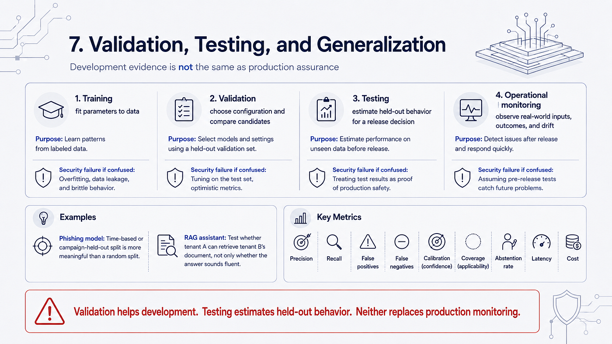

*Figure 12 — Testing estimates held-out behavior; production monitoring checks whether the world still resembles the evaluated conditions.*

For a phishing model, a random split can be misleading if near-duplicate messages from one campaign appear in both training and testing. A time-based split or a campaign-held-out split asks a more operational question: does the detector generalize to a later or unfamiliar campaign? For a RAG assistant, a security test should ask whether tenant A can retrieve tenant B’s document, not only whether the generated answer sounds fluent.

Track precision, recall, false-positive and false-negative counts, calibration, coverage, abstention, latency, and cost. “99% accurate” is not a quarantine policy. The business cost of a false negative may be a delivered payload; the cost of a false positive may be an unavailable executive mailbox. The threshold is part of the security decision.

[Google’s explanation of overfitting](https://developers.google.com/machine-learning/crash-course/overfitting/) is a useful foundation. [NIST AI 100-2](https://csrc.nist.gov/pubs/ai/100/2/e2025/final) extends the vocabulary to adversarial machine learning, including poisoning, evasion, privacy, and misuse attacks across the lifecycle.

## 8. Inference is where authority meets input

**Inference** is execution of a released artifact to produce a prediction, score, embedding, classification, or generation. It is where untrusted input meets model behavior and where output can cross into a consequential system.

```text
caller identity and tenant
  → request validation and rate limits
  → feature extraction / tokenization
  → model, adapter, tokenizer, and configuration route
  → retrieval and authorization filters
  → model output and confidence / citations
  → deterministic policy and output validation
  → human review or bounded side effect
  → audit event and privacy-aware telemetry
```

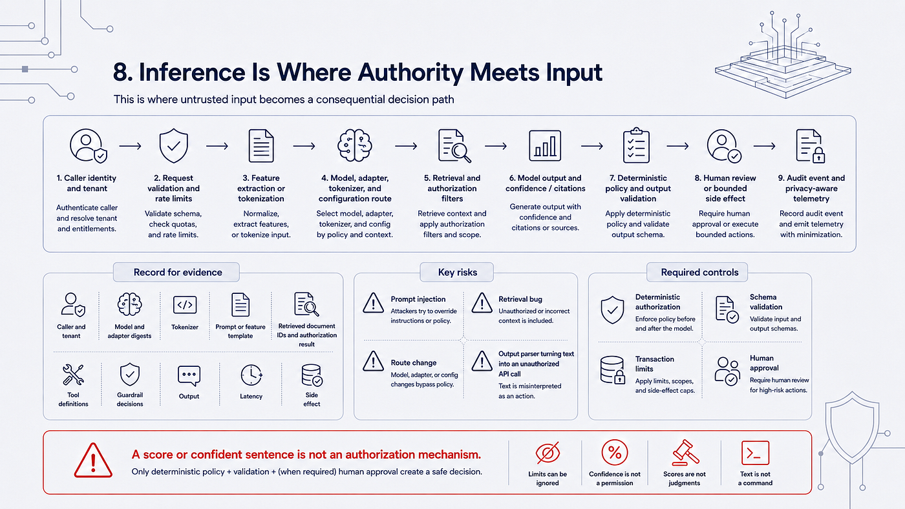

*Figure 13 — Inference is where untrusted input meets a released artifact, authorization, deterministic policy, and possible side effects.*

Record caller and tenant, model and adapter digests, tokenizer, prompt or feature template, retrieved document IDs and authorization result, tool definitions, guardrail decisions, output, latency, and side effect. Minimize sensitive payloads, but retain enough keyed evidence to reconstruct a security-relevant decision.

A prompt injection can change context; a retrieval bug can supply another tenant’s data; a route change can select a different model; an output parser can turn text into an unauthorized API call. Deterministic authorization, schema validation, transaction limits, and human approval must surround inference. A probability score or confident sentence is not an authorization mechanism.

## 9. The same bytes can have different roles

One document can change security meaning as it travels through the lifecycle:

1. Included in a fine-tuning corpus, it is **training data**.
2. Indexed for search, its vector and metadata are **retrieval features**.
3. Inserted into a prompt, it is **inference context**.
4. Used by an evaluator, it is a **test input**.
5. Copied into telemetry, it is **operational log data**.
6. Scored by an analyst, it may produce a **label**.

The bytes may be identical, but the owner, access rule, retention period, audit trail, and threat model are not. During incident response, identify the role of each copy before deciding whether it should be deleted, quarantined, reindexed, retrained on, or disclosed.

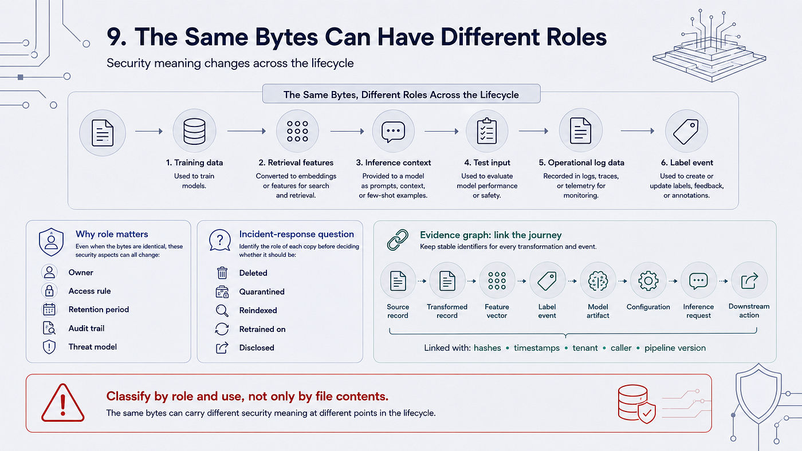

*Figure 14 — The same bytes can have different owners, controls, retention rules, and threat models as they move through the lifecycle.*

### Evidence graph

Use stable identifiers for the source record, transformed record, feature vector, label event, model artifact, configuration, inference request, and downstream action. Link them with hashes, timestamps, tenant, caller, and pipeline version. This creates a causal graph instead of a folder of unconnected screenshots.

## 10. CTI case study: a phishing classifier

Consider a security team that labels incoming messages as `benign` or `phishing`, then quarantines messages above a threshold. The model is only one node in the system:

```text
message and headers
  → parser and feature extraction
  → classifier score
  → threshold and policy
  → quarantine, delivery, or analyst review
  → feedback queue
  → next training dataset
```

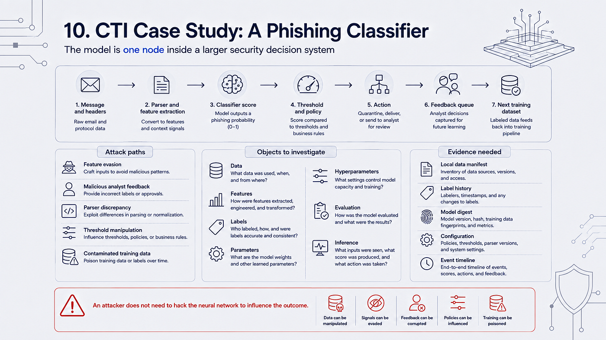

*Figure 15 — A phishing classifier is a system of data, parsing, model score, policy, side effect, feedback, and retraining.*

An attacker does not need to “hack the neural network” to influence the outcome. They may craft message features for evasion, submit malicious analyst feedback, exploit a parser discrepancy, manipulate a threshold configuration, or cause the team to train on contaminated data.

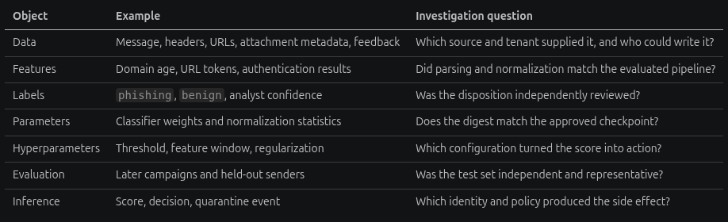

*Figure 16 — Attack paths can target inputs, feedback, parsing, configuration, or future training rather than the neural network directly.*

| Object | Example | Investigation question |
|---|---|---|
| Data | Message, headers, URLs, attachment metadata, feedback | Which source and tenant supplied it, and who could write it? |
| Features | Domain age, URL tokens, authentication results | Did parsing and normalization match the evaluated pipeline? |
| Labels | `phishing`, `benign`, analyst confidence | Was the disposition independently reviewed? |
| Parameters | Classifier weights and normalization statistics | Does the digest match the approved checkpoint? |
| Hyperparameters | Threshold, feature window, regularization | Which configuration turned the score into action? |
| Evaluation | Later campaigns and held-out senders | Was the test set independent and representative? |
| Inference | Score, decision, quarantine event | Which identity and policy produced the side effect? |

NIST describes poisoning attacks as interference during training, including malicious data or changes to the training process. MITRE ATLAS maps the behavior to techniques such as [Poison Training Data](https://atlas.mitre.org/techniques/AML.T0020). These references help an analyst name the behavior, but a defensible case still needs the local data manifest, label history, model digest, configuration, and event timeline.

> **Evidence standard:** Report what is observed, what is reproduced, what is inferred, and what remains unknown. A research demonstration of poisoning is not automatically a confirmed intrusion. A provider report of abuse is not automatically evidence that your tenant was affected.

## 11. From terminology to controls and evidence

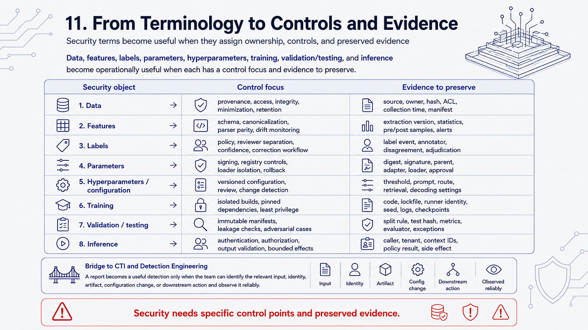

*Figure 17 — Terminology becomes operational when every security object has an owner, control focus, and evidence record.*

The terms become useful when they assign ownership and a control point.

| Security object | Control focus | Evidence to preserve |
|---|---|---|
| Data | Provenance, access, integrity, minimization, retention | Source, owner, hash, ACL, collection time, manifest |
| Features | Schema, canonicalization, parser parity, drift monitoring | Extraction version, statistics, pre/post samples, alerts |
| Labels | Policy, reviewer separation, confidence, correction workflow | Label event, annotator, disagreement, adjudication |
| Parameters | Signing, registry controls, loader isolation, rollback | Digest, signature, parent, adapter, loader, approval |
| Hyperparameters | Versioned configuration, review, change detection | Threshold, prompt, route, retrieval, decoding settings |
| Training | Isolated builds, pinned dependencies, least privilege | Code, lockfile, runner identity, seed, logs, checkpoints |
| Validation/testing | Immutable manifests, leakage checks, adversarial cases | Split rule, test hash, metrics, evaluator, exceptions |
| Inference | Authentication, authorization, output validation, bounded effects | Caller, tenant, context IDs, policy result, side effect |

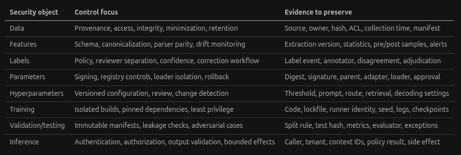

*Figure 18 — CTI becomes detection engineering when claims connect to identifiable inputs, identities, artifacts, configuration changes, and actions.*

This is also the bridge from CTI to detection engineering. A report can become a useful detection only after the team can identify the relevant input, identity, artifact, configuration change, or downstream action and can observe it reliably.

## 12. Analyst exercise and completion criteria

Choose one AI system you can inspect safely: a local classifier, a RAG demo, or a course-owned LLM application. Do not upload confidential data or test a system without authorization.

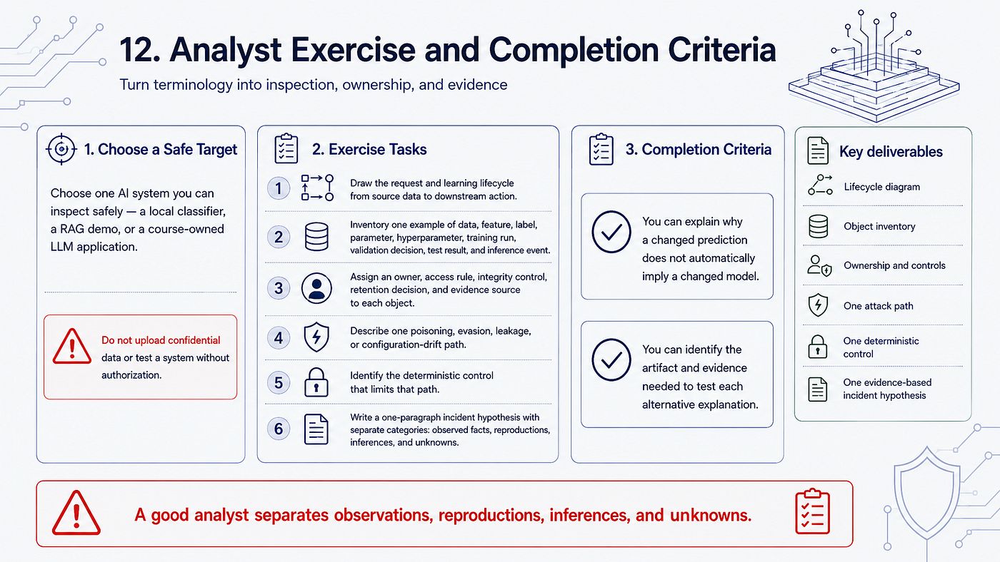

*Figure 19 — The exercise turns the chapter vocabulary into a traceable analyst workflow.*

1. Draw the request and learning lifecycle from source data to downstream action.
2. Inventory one example of data, feature, label, parameter, hyperparameter, training run, validation decision, test result, and inference event.
3. Assign an owner, access rule, integrity control, retention decision, and evidence source to each object.
4. Describe one poisoning, evasion, leakage, or configuration-drift path and the deterministic control that limits it.
5. Write a one-paragraph incident hypothesis with separate observed facts, reproductions, inferences, and unknowns.

You have completed this chapter when you can explain why a changed prediction does not automatically imply a changed model, and when you can identify the artifact and evidence needed to test each alternative explanation.

## Key takeaways

- Data, features, labels, parameters, hyperparameters, training, validation, testing, and inference are distinct security objects.
- Data provenance and access control must survive transformation, indexing, prompting, logging, and feedback.
- A model file can be a software-supply-chain input; a vector index and a prompt can also carry attacker-controlled influence.
- Validation supports development choices; testing estimates held-out behavior; neither replaces production monitoring.
- A score or generated output is evidence for a policy decision, not the policy or authorization itself.
- Use CTI frameworks to name and map behavior, but match every claim to the evidence level of the underlying report or reproduction.

## References

- [NIST AI 100-2 E2025 — Adversarial Machine Learning: A Taxonomy and Terminology of Attacks and Mitigations](https://csrc.nist.gov/pubs/ai/100/2/e2025/final)
- [NIST AI 100-3 — The Language of Trustworthy AI](https://doi.org/10.6028/NIST.AI.100-3)
- [MITRE ATLAS — Adversarial Threat Landscape for Artificial-Intelligence Systems](https://atlas.mitre.org/)
- [MITRE ATLAS AML.T0020 — Poison Training Data](https://atlas.mitre.org/techniques/AML.T0020)
- [Google Cloud — Monitor models for training-serving skew](https://cloud.google.com/blog/topics/developers-practitioners/monitor-models-training-serving-skew-vertex-ai)
- [Google Machine Learning Crash Course — Overfitting and generalization](https://developers.google.com/machine-learning/crash-course/overfitting/)
- [JFrog Security Research — Malicious Hugging Face ML Models](https://jfrog.com/blog/data-scientists-targeted-by-malicious-hugging-face-ml-models-with-silent-backdoor/)
- [Mithril Security — PoisonGPT demonstration](https://www.mithrilsecurity.io/blog/poisongpt-how-we-hid-a-lobotomized-llm-on-hugging-face-to-spread-fake-news) (research case, not a confirmed campaign)
- [Lewis et al. — Retrieval-Augmented Generation for Knowledge-Intensive NLP Tasks](https://arxiv.org/abs/2005.11401)

## What comes next

[Chapter 3 — Neural Networks and Optimization](https://1200km.com/ai-security-course/module-00/chapter-03.html) explains forward passes, loss, gradients, backpropagation, generalization, adversarial examples, and the evidence needed to distinguish model behavior from data or configuration changes.

---

**AI Security Engineering Course — under construction.** The syllabus, examples, references, labs, and assessment criteria may change during creation.

[1200km.com](https://1200km.com) · [Main course article on Medium](https://medium.com/@1200km/im-building-an-ai-security-engineering-course-55e29e6c035e)
