# Ten-case screenshot gallery

These are unaltered browser captures from the actual local AdversaryGraph instance. Saved responses were checked against archived results. No new analyses, provider lookups, or case writes were performed to produce them.

A screenshot verifies presentation, not malware classification. Surrounding application history may include other saved investigations. Native PCAP results are deterministic even when a general AI-provider selector appears in the screen.

[Article](https://1200km.com/articles/read/2026/2026-09-20-adversarygraph-vs-ten-malware-pcaps-evidence-7dfd6a0917cf/) · [Report index](REPORTS.md) · [Capture verification and hashes](evidence/screenshot-verification.json)

## 2021-09-10 — AngryPoutine

[Full case report](reports/cases/2021-09-10/REPORT.md) · [Native JSON](reports/cases/2021-09-10/api-upload.json)

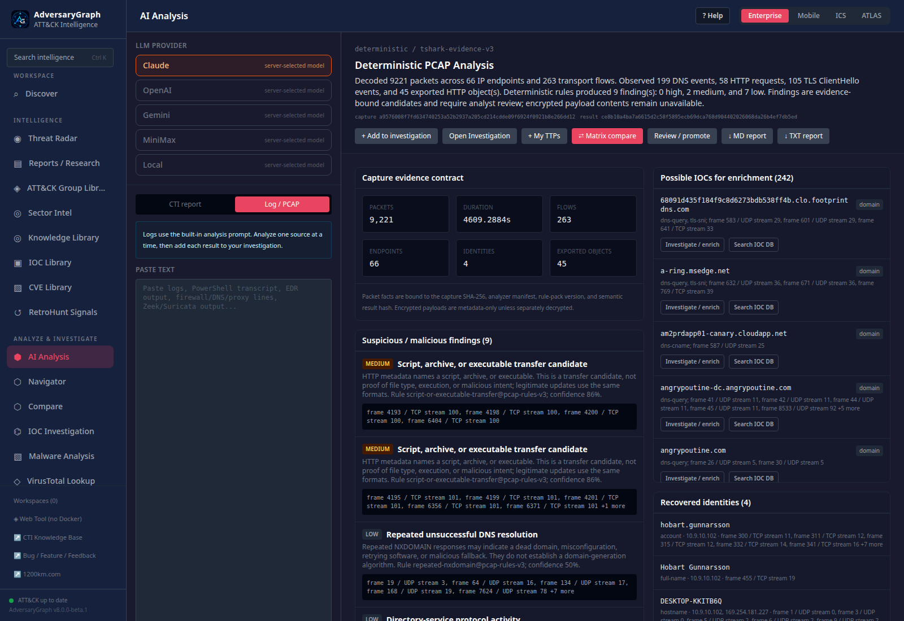

*Packet view: capture facts and native rule findings. Visible severity and confidence are heuristic outputs.*

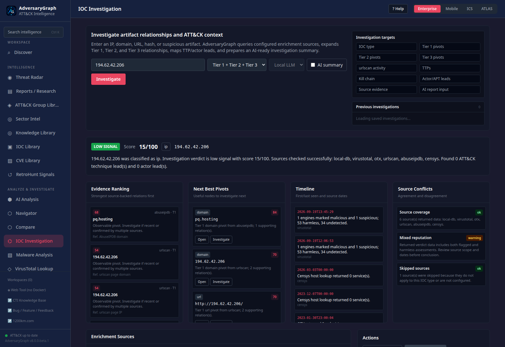

*Enrichment view: one saved indicator investigation from this case. A provider result or platform score is not independent proof of compromise.*

## 2021-10-22 — October ISC Forensic Contest

[Full case report](reports/cases/2021-10-22/REPORT.md) · [Native JSON](reports/cases/2021-10-22/api-upload.json)

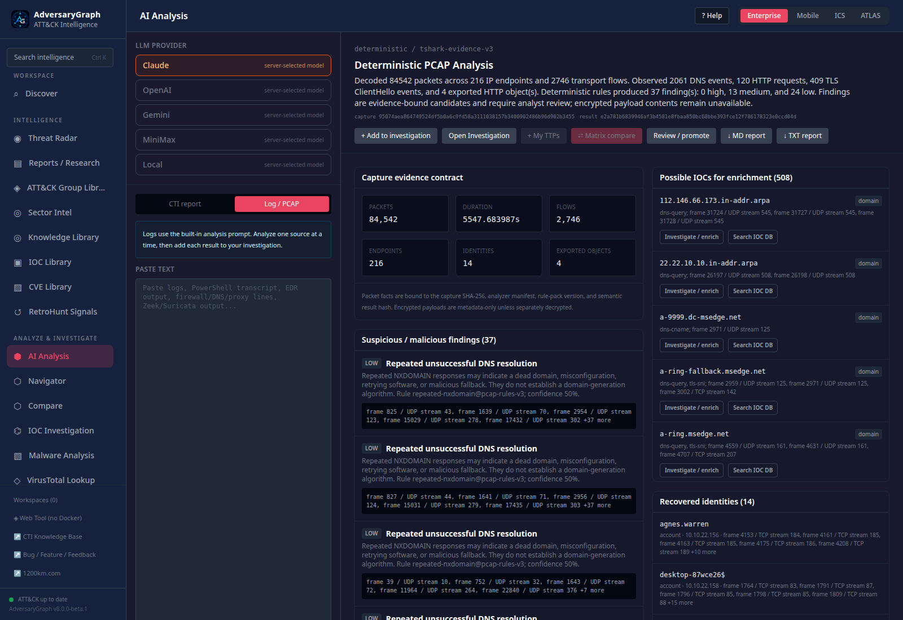

*Packet view: capture facts and native rule findings. Visible severity and confidence are heuristic outputs.*

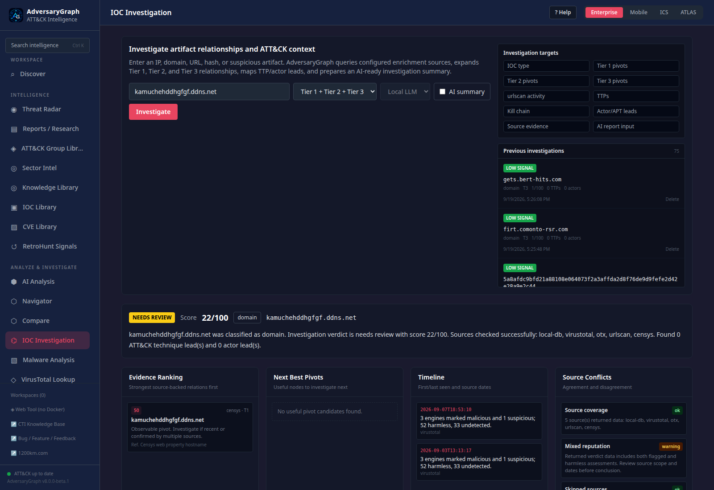

*Enrichment view: one saved indicator investigation from this case. A provider result or platform score is not independent proof of compromise.*

## 2021-12-08 — December ISC Forensic Contest

[Full case report](reports/cases/2021-12-08/REPORT.md) · [Native JSON](reports/cases/2021-12-08/api-upload.json)

*Packet view: capture facts and native rule findings. Visible severity and confidence are heuristic outputs.*

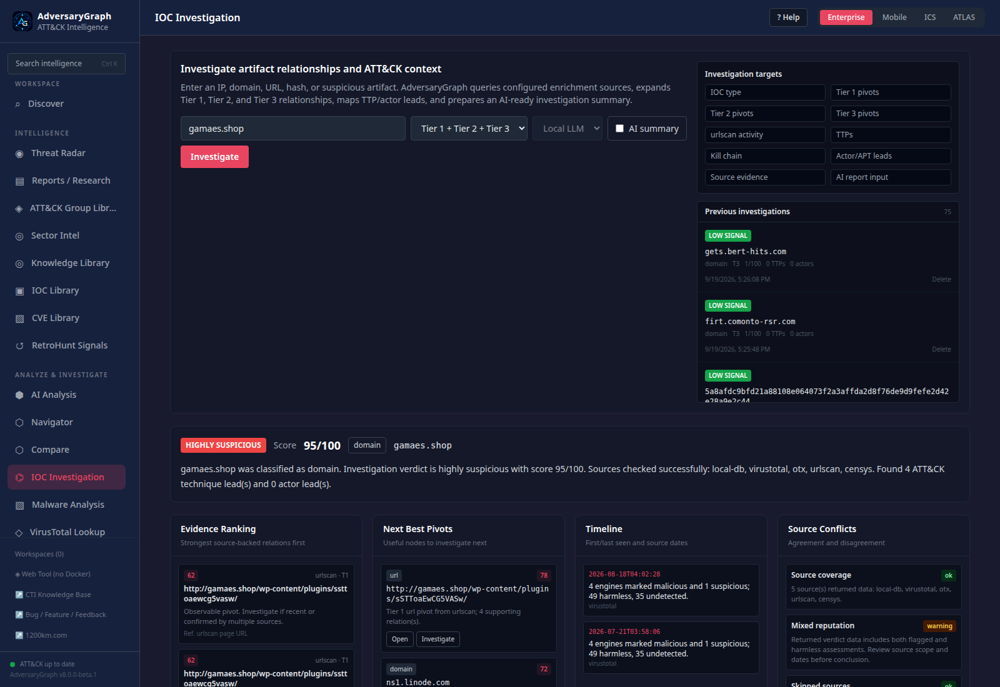

*Enrichment view: one saved indicator investigation from this case. A provider result or platform score is not independent proof of compromise.*

## 2022-01-07 — Spoonwatch

[Full case report](reports/cases/2022-01-07/REPORT.md) · [Native JSON](reports/cases/2022-01-07/api-upload.json)

*Packet view: capture facts and native rule findings. Visible severity and confidence are heuristic outputs.*

*Enrichment view: one saved indicator investigation from this case. A provider result or platform score is not independent proof of compromise.*

## 2022-02-23 — Sunnystation

[Full case report](reports/cases/2022-02-23/REPORT.md) · [Native JSON](reports/cases/2022-02-23/api-upload.json)

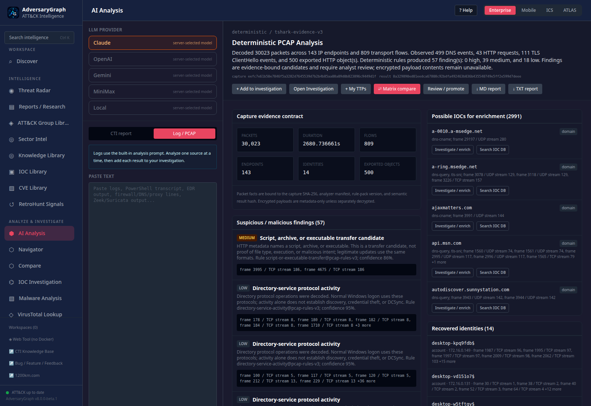

*Packet view: capture facts and native rule findings. Visible severity and confidence are heuristic outputs.*

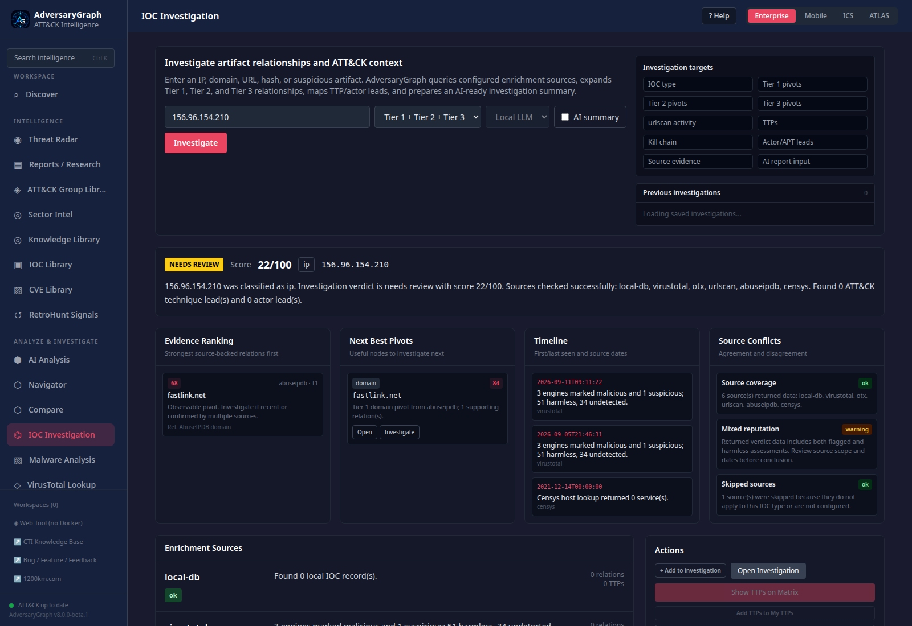

*Enrichment view: one saved indicator investigation from this case. A provider result or platform score is not independent proof of compromise.*

## 2022-03-21 — Burnincandle

[Full case report](reports/cases/2022-03-21/REPORT.md) · [Native JSON](reports/cases/2022-03-21/api-upload.json)

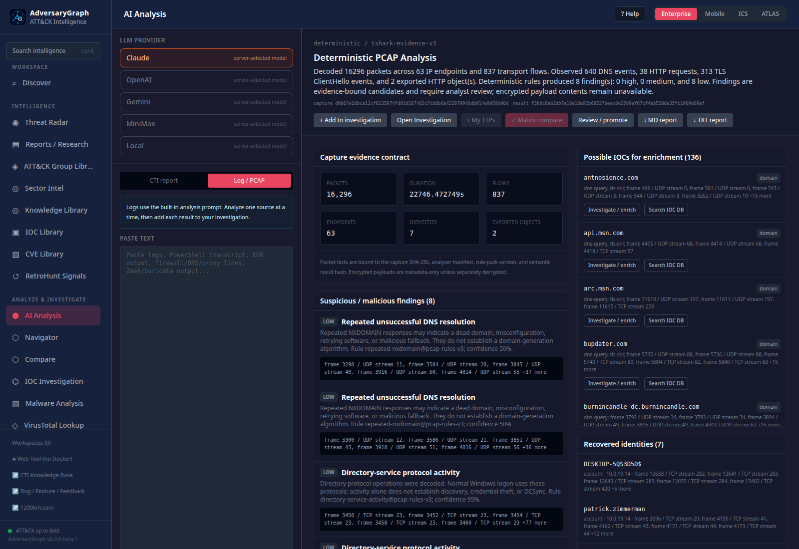

*Packet view: capture facts and native rule findings. Visible severity and confidence are heuristic outputs.*

*Enrichment view: one saved indicator investigation from this case. A provider result or platform score is not independent proof of compromise.*

## 2024-07-30 — You dirty rat!

[Full case report](reports/cases/2024-07-30/REPORT.md) · [Native JSON](reports/cases/2024-07-30/api-upload.json)

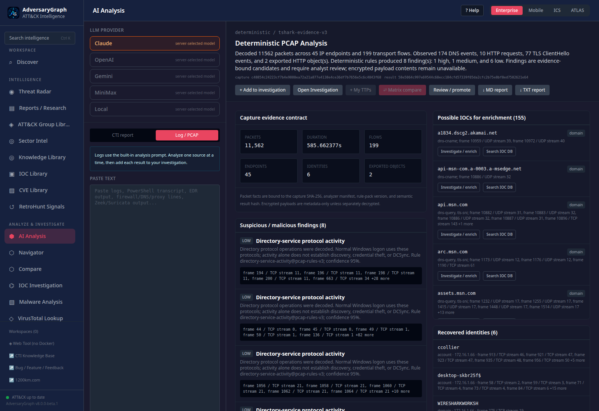

*Packet view: capture facts and native rule findings. Visible severity and confidence are heuristic outputs.*

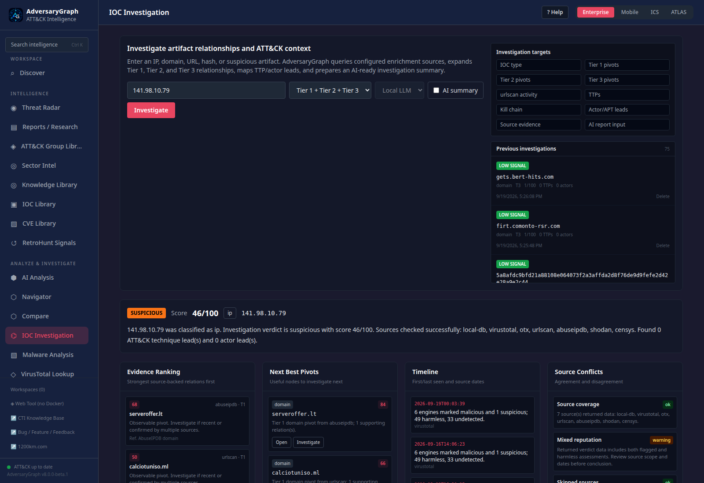

*Enrichment view: one saved indicator investigation from this case. A provider result or platform score is not independent proof of compromise.*

## 2024-08-15 — WarmCookie

[Full case report](reports/cases/2024-08-15/REPORT.md) · [Native JSON](reports/cases/2024-08-15/api-upload.json)

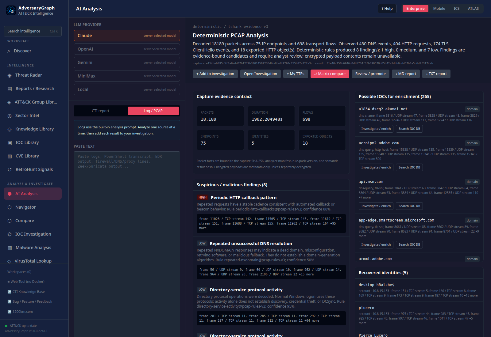

*Packet view: capture facts and native rule findings. Visible severity and confidence are heuristic outputs.*

*Enrichment view: one saved indicator investigation from this case. A provider result or platform score is not independent proof of compromise.*

## 2024-09-04 — Big Fish in a Little Pond

[Full case report](reports/cases/2024-09-04/REPORT.md) · [Native JSON](reports/cases/2024-09-04/api-upload.json)

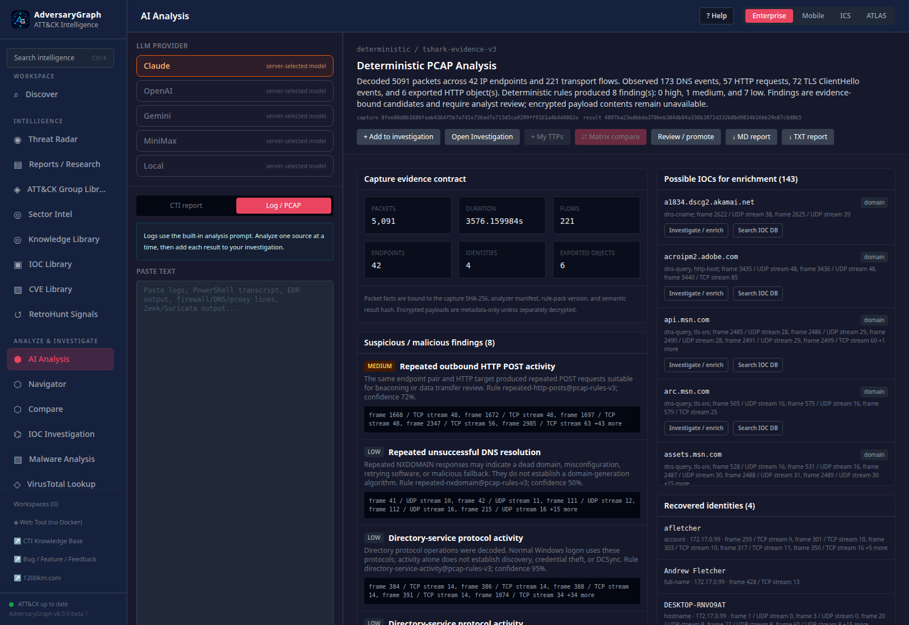

*Packet view: capture facts and native rule findings. Visible severity and confidence are heuristic outputs.*

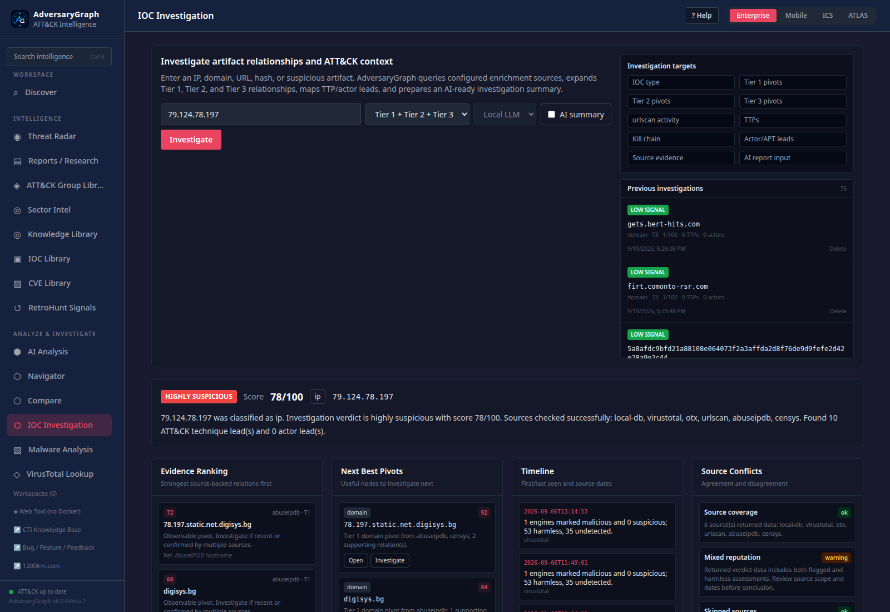

*Enrichment view: one saved indicator investigation from this case. A provider result or platform score is not independent proof of compromise.*

## 2024-11-26 — Nemotodes

[Full case report](reports/cases/2024-11-26/REPORT.md) · [Native JSON](reports/cases/2024-11-26/api-upload.json)

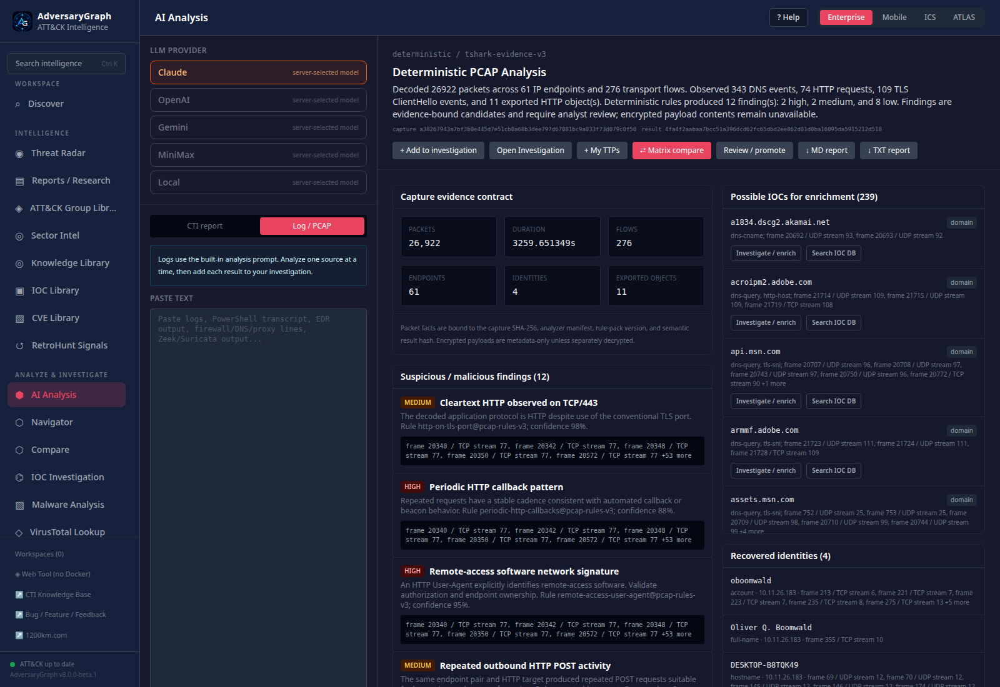

*Packet view: capture facts and native rule findings. Visible severity and confidence are heuristic outputs.*

*Enrichment view: one saved indicator investigation from this case. A provider result or platform score is not independent proof of compromise.*
